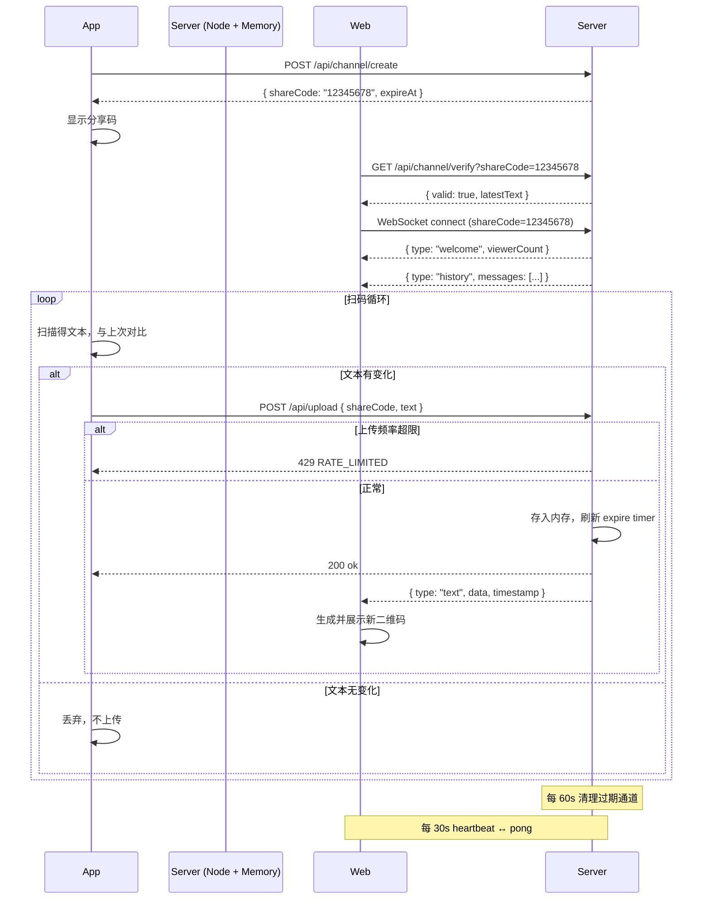

# 项目需求文档：二维码实时扫描与展示系统

## 1. 项目概述

### 1.1 项目名称

**二维码实时扫描与展示系统**（简称 QR-Live）

### 1.2 项目背景

需要实现一个双向实时的二维码数据流系统：移动端（App）通过摄像头持续扫描二维码并解码为文本，将文本上传至服务器；Web 端（HTTP 面板）根据接收到的文本实时生成二维码并展示。系统支持多用户/多通道隔离，每个上传者通过一个临时生成的 8 位数字分享码标识自己的数据流，Web 端需要输入该分享码才能查看对应通道的二维码。

### 1.3 核心价值

- 实现低成本、跨平台的实时二维码传输与展示。
- 支持多路并行会话，互不干扰。
- 提供简单的访问控制机制（分享码）。

---

## 2. 用户角色

| 角色       | 描述                                                  |
| ---------- | ----------------------------------------------------- |
| **上传者** | 使用 App 扫描二维码并上传解码文本的用户。             |
| **观看者** | 通过 Web 面板输入分享码，查看实时生成的二维码的用户。 |

---

## 3. 功能需求

### 3.1 移动端 App 功能

| ID     | 功能点         | 描述                                                                                                                                                                                  |
| ------ | -------------- | ------------------------------------------------------------------------------------------------------------------------------------------------------------------------------------- |
| APP-01 | 启动扫码       | App 启动后自动开启摄像头，持续扫描二维码。                                                                                                                                            |
| APP-02 | 解码与上传     | 每次成功解码得到文本后，**仅当文本内容与上一次成功解码不同时才上传**（去重逻辑），通过 HTTP API 将文本上传至服务器。                                                                  |
| APP-03 | 分享码自动生成 | 每次上传者开始上传时（首次扫码或新建会话），App 向服务器请求一个 **8 位数字分享码**（例如 `12345678`）。该分享码用于标识本次上传会话。                                                |
| APP-04 | 分享码展示     | App 界面应显示当前使用的分享码（大号字体，可复制），方便上传者告知观看者。                                                                                                            |
| APP-05 | 上传状态反馈   | 显示每次上传结果（成功/失败/限流等待），以及当前连接状态。                                                                                                                            |
| APP-06 | 切换/新建会话  | 提供按钮允许上传者结束当前会话并申请新的分享码开始新会话。**[当前未实现，待后续版本]**                                                                                                |
| APP-07 | 离线缓存队列   | 网络异常时，将待上传文本缓存在内存队列中（**上限 6 条，队列满后丢弃最旧条目**）。网络恢复后按 FIFO 顺序重传，每条重传前仍需检查去重逻辑（以缓存中最新的那条与上次成功上传的做对比）。 |
| APP-08 | 分享码过期处理 | 收到服务端返回"分享码已过期"错误时，App **自动重新申请**新分享码，同时清空离线队列并恢复上传，过程中需在 UI 提示用户"会话已过期，已自动重建"。                                        |
| APP-09 | 上传频率控制   | App 端需做本地频率限制，**保证向服务器发送的上传请求 ≤ 2 次/秒**。若连续扫码导致触发限流，应在上传前做节流排队，排队中的文本取最后一条（合并中间态），避免堆积。                      |

### 3.2 服务器端功能

| ID     | 功能点         | 描述                                                                                                                                                                    |
| ------ | -------------- | ----------------------------------------------------------------------------------------------------------------------------------------------------------------------- |
| SVR-01 | 分享码管理     | 生成 8 位随机数字分享码，保证在有效期内唯一。分享码有效期由**最后一次上传时间 + 30 分钟**决定：若 30 分钟内无新上传，分享码自动失效并从内存中清除。不提供手动关闭接口。 |
| SVR-02 | 文本消息接收   | 接收 App 上传的（分享码, 文本）数据，将文本按分享码存储在内存中（仅保留**最新一条文本**，不持久化）。每收到一次上传，刷新该分享码的过期计时器。                         |
| SVR-03 | 实时数据推送   | 提供 WebSocket 接口，根据分享码向所有订阅该通道的 Web 面板推送最新的文本数据。                                                                                          |
| SVR-04 | Web 面板服务   | 提供 HTTP 静态页面（Vue 应用）及 API 服务。                                                                                                                             |
| SVR-05 | 分享码验证     | 提供 API 用于验证分享码是否有效，并返回该通道的最新文本数据（若有）。                                                                                                   |
| SVR-06 | 上传频率限制   | 按分享码维度限流，**每个分享码每秒最多接受 2 次上传**。超限返回 `429`。限流算法使用**滑动窗口**（窗口大小 1 秒，窗口内上限 2 次）。                                     |
| SVR-07 | 并发观看者限制 | 每个分享码通道**最多允许 50 个 WebSocket 连接**同时订阅。超出时拒绝新连接并返回明确错误消息。                                                                           |
| SVR-08 | 定时清理       | 每 60 秒扫描一次内存中的所有分享码，清除已过期（lastUploadAt + 30min < now）的通道，关闭该通道所有 WebSocket 连接并推送过期通知。                                       |

### 3.3 Web 面板功能（Vue 3）

| ID     | 功能点         | 描述                                                                                                                                                                                                       |
| ------ | -------------- | ---------------------------------------------------------------------------------------------------------------------------------------------------------------------------------------------------------- |
| WEB-01 | 分享码输入     | 页面初始状态显示输入框，用户输入 8 位数字分享码。输入框仅允许输入 8 位数字，输入不满 8 位时"开始展示"按钮禁用。                                                                                            |
| WEB-02 | 连接与展示     | 点击"开始展示"后，先调用 `GET /api/channel/verify` 验证分享码有效性，验证通过后建立 WebSocket 连接。                                                                                                       |
| WEB-03 | 二维码实时生成 | 每当收到新的文本，前端即时将该文本生成二维码并展示。二维码参数规定：**画布尺寸 256×256 px、纠错级别 H（30%）、边距 4 模块（margin: 4）**。                                                                 |
| WEB-04 | 状态提示       | 显示以下状态：**"未连接"**（初始）→ **"正在验证…"**（验证中）→ **"等待数据…"**（已连接但尚无数据）→ **"已连接"**（正常运行）→ **"连接断开，正在重连…"**（断线重连中）→ **"通道已过期"**（分享码失效）。    |
| WEB-05 | 切换分享码     | 提供"断开当前连接"按钮和"重新输入分享码"入口，允许观看者切换观看其他通道。                                                                                                                                 |
| WEB-06 | 响应式布局     | 适配不同屏幕尺寸（PC、平板、手机横屏）。二维码区域在移动端自适应缩放，最小不低于 200px。                                                                                                                   |
| WEB-07 | 历史文本展示   | 二维码下方展示**当前通道接收到的全部文本历史**（从 WebSocket 连接后开始记录），以时间倒序的列表形式展示，每条含时间戳和文本内容。列表最多保留 **200 条**，超出后丢弃最早记录。                             |
| WEB-08 | 断线重连       | WebSocket 意外断开时自动重连，采用**指数退避**策略：初始重试间隔 1s、最大间隔 30s、最多重试 5 次。**重连期间保留最后一个二维码不变**，状态显示"连接断开，正在重连…（第 N 次）"。5 次失败后停止重连并提示。 |

---

## 4. 非功能需求

| 类别       | 要求                                                                                                                                     |
| ---------- | ---------------------------------------------------------------------------------------------------------------------------------------- |
| **并发性** | 支持至少 100 个同时活跃的分享码通道，每个通道每秒最多 2 次文本上传。每个通道最多 50 个 WebSocket 观看连接。                              |
| **实时性** | 从 App 上传文本到 Web 端展示二维码的延迟 ≤ 500ms（不含网络传输）。                                                                       |
| **安全性** | 分享码为简单的访问控制，无复杂认证。防止暴力枚举：**同一 IP 每分钟最多 10 次验证请求**。传输使用 HTTPS/WSS。                             |
| **可用性** | 服务器基于内存管理分享码，**无持久化存储**。分享码在无上传活动 30 分钟后自动失效并从内存移除。服务重启后所有数据丢失，分享码需重新申请。 |
| **可靠性** | App 端内存缓存队列（上限 6 条）在恢复网络后重传。Web 面板 WebSocket 断线自动重连（指数退避，最多 5 次）。                                |
| **兼容性** | App 端支持 Android 8+ / iOS 13+；Web 面板支持现代浏览器（Chrome, Edge, Safari, Firefox 近 2 个大版本）。                                 |

---

## 5. 技术栈

| 层级             | 技术选型                                                                                                                   |
| ---------------- | -------------------------------------------------------------------------------------------------------------------------- |
| **App 端**       | React Native / Flutter / 原生（推荐 Flutter 或 React Native 以跨平台）**[当前版本：Web 端内置 jsQR 扫码，复用 Vue 3 SPA]** |
| **后端服务**     | Node.js + Express + 原生 `ws` 库（不使用 Socket.io）                                                                       |
| **实时通信**     | 原生 WebSocket（`ws` 库）                                                                                                  |
| **数据存储**     | **纯内存存储**（`Map<string, Channel>`），不引入 Redis 或任何数据库。服务重启数据全部丢失，符合设计预期。                  |
| **反向代理**     | Caddy（自动 HTTPS，内置 WebSocket 代理支持）                                                                               |
| **容器化**       | 单容器部署：Caddy + Node.js 打包为单个 Docker 镜像                                                                         |
| **Web 面板**     | Vue 3 + Vite + pnpm + Tailwind CSS（class 模式）                                                                           |
| **二维码生成库** | QRCode.js (web) / 客户端原生库 (App)                                                                                       |
| **扫码库**       | 移动端使用 `react-native-vision-camera` 或 `expo-camera` / 原生 ZXing                                                      |

---

## 6. API 接口设计

### 6.0 统一错误响应格式

所有错误响应遵循以下 JSON 结构：

```json
{
  "code": <HTTP 状态码>,
  "error": "<简短错误类型>",
  "message": "<面向开发者的描述信息>"
}
```

**错误码一览**：

| HTTP 状态码 | error                    | 触发场景                       |
| ----------- | ------------------------ | ------------------------------ |
| 400         | `INVALID_SHARE_CODE`     | 分享码格式无效（非 8 位数字）  |
| 400         | `TEXT_TOO_LONG`          | 上传文本超过 2000 字符         |
| 400         | `TEXT_EMPTY`             | 上传文本为空                   |
| 400         | `INVALID_EXPIRE_SECONDS` | expire_seconds 超出 [60, 7200] |
| 404         | `CHANNEL_NOT_FOUND`      | 分享码不存在或已过期           |
| 429         | `RATE_LIMITED`           | 单分享码上传频率超过 2 次/秒   |
| 429         | `VERIFY_RATE_LIMITED`    | 验证接口 IP 限流（>10 次/分）  |
| 429         | `TOO_MANY_VIEWERS`       | 通道观看者已满（≥50）          |

### 6.1 分享码申请

- **端点**：`POST /api/channel/create`
- **请求体**：`{ "expire_seconds": 1800 }`（可选，默认 1800，范围 [60, 7200]）
- **成功响应**：

```json
{
  "code": 201,
  "data": {
    "shareCode": "12345678",
    "expireAt": "2025-04-01T12:30:00Z",
    "createdAt": "2025-04-01T12:00:00Z"
  }
}
```

### 6.2 文本上传

- **端点**：`POST /api/upload`
- **Content-Type**：`application/json`
- **请求体**：

```json
{
  "shareCode": "12345678",
  "text": "扫描到的文本内容"
}
```

- **字段约束**：
  - `shareCode`：必须为 8 位数字字符串。
  - `text`：UTF-8 字符串，长度 1–2000 字符（空字符串视为无效）。

- **成功响应**：

```json
{
  "code": 200,
  "message": "ok"
}
```

- **错误响应示例**：

```json
{ "code": 404, "error": "CHANNEL_NOT_FOUND", "message": "分享码不存在或已过期" }
```

```json
{ "code": 429, "error": "RATE_LIMITED", "message": "上传频率过高，请稍后重试" }
```

### 6.3 分享码验证（WebSocket 连接前）

- **端点**：`GET /api/channel/verify?shareCode=12345678`
- **限流**：同一 IP 每分钟最多 10 次，超出返回 `429 VERIFY_RATE_LIMITED`。
- **成功响应**：

```json
{
  "code": 200,
  "valid": true,
  "latestText": "最新文本（无数据时为 null）",
  "updatedAt": "2025-04-01T12:05:00Z"
}
```

- **分享码不存在时**：返回 404，非 200+valid=false（避免枚举）。

### 6.4 WebSocket 实时通道

#### 6.4.1 连接

- **连接地址**：`wss://<host>/ws?shareCode=12345678`
- **握手验证**：服务端在 WebSocket 升级握手阶段验证 `shareCode` 参数：
  - 若缺少 `shareCode` 参数：拒绝升级，返回 HTTP 400。
  - 若握手通过但分享码无效/已过期：接受升级后立即发送关闭帧，状态码 **4001** 原因为 `CHANNEL_NOT_FOUND`。
  - 若观看者已满（≥50）：接受升级后立即发送关闭帧，状态码 **4002** 原因为 `TOO_MANY_VIEWERS`。
  - 若分享码有效且观看者未满（<50）：完成升级，发送欢迎消息。

#### 6.4.2 消息格式

所有 WebSocket 消息为 **JSON 文本帧**，字段如下：

**服务器 → 客户端**：

| type              | 触发时机            | 附带字段                         |
| ----------------- | ------------------- | -------------------------------- |
| `welcome`         | 连接成功后立即发送  | `shareCode`, `viewerCount`       |
| `text`            | 收到 App 新上传文本 | `data`, `timestamp`（Unix ms）   |
| `history`         | `welcome` 后发送    | `messages[]`（连接前的最新文本） |
| `channel_expired` | 分享码过期          | `message`                        |
| `heartbeat`       | 服务端定期发送      | `serverTime`（Unix ms）          |

**客户端 → 服务器**：

| type   | 说明           | 附带字段 |
| ------ | -------------- | -------- |
| `pong` | 响应服务端心跳 | 无       |

#### 6.4.3 消息示例

**welcome**：

```json
{
  "type": "welcome",
  "shareCode": "12345678",
  "viewerCount": 3
}
```

**text（新文本推送）**：

```json
{
  "type": "text",
  "data": "扫描到的文本内容",
  "timestamp": 1711987200000
}
```

**history（连接前最新文本）**：

```json
{
  "type": "history",
  "messages": [{ "data": "上一次扫描的文本", "timestamp": 1711987190000 }]
}
```

**channel_expired**：

```json
{
  "type": "channel_expired",
  "message": "该分享码已过期（30 分钟无上传），连接即将关闭"
}
```

**heartbeat / pong**：

```json
{ "type": "heartbeat", "serverTime": 1711987200000 }
```

```json
{ "type": "pong" }
```

#### 6.4.4 心跳策略

- **服务端**：每 **30 秒**发送一次 `heartbeat` 消息。
- **客户端**：收到 `heartbeat` 后应在 **10 秒内**回复 `pong`。
- **超时判定**：
  - 服务端：若连续 **3 次** heartbeat 未收到 pong（即 90 秒无响应），判定客户端已断开，主动关闭连接。
  - 客户端：若 **60 秒**未收到任何服务端消息（包括 heartbeat），判定连接异常，触发重连。

#### 6.4.5 断线重连策略（客户端）

| 参数           | 值                                                           |
| -------------- | ------------------------------------------------------------ |
| 初始重试间隔   | 1 秒                                                         |
| 最大重试间隔   | 30 秒                                                        |
| 退避算法       | 指数退避（×2）：1s → 2s → 4s → 8s → 16s → 30s（封顶）        |
| 最大重试次数   | 5 次                                                         |
| 重连期间 UI    | 保留最后一个二维码不变，显示"连接断开，正在重连…（第 N 次）" |
| 5 次全部失败后 | 显示"连接失败，请检查网络或重新输入分享码"                   |

---

## 7. 界面草图（文字描述）

### 7.1 App 界面

- **顶部**：当前分享码（大号等宽字体，点击可复制），旁边显示频道状态灯（绿色=正常，黄色=等待，红色=过期/错误）。
- **中部**：摄像头预览画面（全宽，保持视频比例），画面四角有扫描框引导线。
- **底部**：
  - 上传状态指示："已上传：xx 条" + 最近一次上传时间。
  - "新建会话"按钮（确认弹窗："当前会话将失效，确认新建？"）。
  - 离线缓存指示：网络异常时显示黄色警告条 "网络异常，数据将在恢复后重传（缓存 N/6）"。

### 7.2 Web 面板界面

- **未连接时**：
  - 页面中央显示系统标题 "QR-Live"。
  - 8 位数字输入框（等宽字体，居中，仅接受数字输入）。
  - "开始展示"按钮（不满 8 位时灰色禁用）。
  - 底部提示文字："请向 App 用户索取 8 位分享码"。

- **连接后**：
  - 中央大区域展示 256×256 的二维码（居中，白色背景，带圆角阴影卡片）。
  - 二维码下方显示收到的文本原文（等宽字体，可选中复制）。
  - 二维码卡片左上角有状态指示器（绿点="已连接"）。
  - 右侧面板或下方折叠区：历史文本列表（时间倒序，每条含 ISO 时间戳 + 文本摘要）。
  - 右上角："切换分享码" 按钮（点击先断开当前连接，返回未连接界面）。

- **断线重连时**：
  - 二维码保持最后一个不变（画面不变，加半透明灰色遮罩）。
  - 遮罩上方显示旋转加载图标 + "连接断开，正在重连…（第 3/5 次）"。

- **通道过期时**：
  - 全屏覆盖提示："该分享码已过期" + 说明文字 + "重新输入分享码"按钮。

---

## 8. 数据流时序图



---

## 9. 非功能性补充

### 9.1 性能指标

| 指标                 | 目标值                                        |
| -------------------- | --------------------------------------------- |
| 并发通道             | 100                                           |
| 单通道最大上传频率   | 2 次/秒（服务端强制限流）                     |
| 单通道最大观看者     | 50                                            |
| WebSocket 连接总数   | 200 同时在线                                  |
| 内存占用（100 通道） | 每通道存储最新文本（≤2KB），总计 <1MB，可忽略 |
| 单次 API 响应时间    | P95 < 50ms                                    |
| 端到端延迟           | App 上传 → Web 展示 ≤ 500ms                   |

### 9.2 安全策略

| 策略         | 细节                                                                                                       |
| ------------ | ---------------------------------------------------------------------------------------------------------- |
| 分享码空间   | 8 位数字，共 10^8 种组合，随机生成，冲突时重试（概率极低）                                                 |
| 验证限流     | 同一 IP 每分钟最多 10 次 verify 请求（滑动窗口）                                                           |
| 上传限流     | 每个分享码每秒最多 2 次（滑动窗口）                                                                        |
| 传输加密     | 全站 HTTPS/WSS（Caddy 自动管理证书）                                                                       |
| 文本长度限制 | 上传文本 1–2000 字符（UTF-8），空字符串拒绝                                                                |
| 无认证模式   | 分享码即为唯一凭证，不设用户注册/登录                                                                      |
| 观看者无排他 | 多个观看者连接同一通道各自独立，数据推送为广播模式，各观看者因连接时间不同可能看到不同数据，这在设计上允许 |

### 9.3 部署环境

| 组件           | 方案                                                                                                                                                                                               |
| -------------- | -------------------------------------------------------------------------------------------------------------------------------------------------------------------------------------------------- |
| **容器化**     | 单 Docker 容器，内运行 Caddy + Node.js。Caddy 负责 HTTPS 自动证书和 WebSocket 反向代理。                                                                                                           |
| **Caddy 配置** | Caddy 监听 80/443，自动申请 Let's Encrypt 证书；将所有 `/ws` 路径代理到 Node.js 的 WebSocket 端口（如 `:41602`）；`/api/*` 路径代理到 Node.js HTTP 服务（如 `:41601`）；其余请求 serve 静态文件。  |
| **Node.js**    | 单进程运行，内存中维护 `Map<string, ChannelState>` 存储所有通道状态。                                                                                                                              |
| **静态资源**   | Web 面板构建产物由 Caddy 直接 serve（`/*` → `/srv/web/dist`，含 SPA fallback），无需 Node.js 参与静态文件。                                                                                        |
| **环境变量**   | `PORT_HTTP`（默认 41601）、`PORT_WS`（默认 41602）、`CHANNEL_TTL_SECONDS`（默认 1800）、`CLEANUP_INTERVAL_SECONDS`（默认 60）、`UPLOAD_RATE_LIMIT`（默认 2）、`MAX_VIEWERS_PER_CHANNEL`（默认 50） |

### 9.4 内存数据结构设计（参考）

```typescript
interface ChannelState {
  shareCode: string; // "12345678"
  latestText: string | null; // 最新文本
  lastUploadAt: number; // 最后上传时间戳 (ms)
  createdAt: number; // 创建时间戳 (ms)
  uploadCount: number; // 累计上传次数
  uploadWindow: number[]; // 滑动窗口：最近 1s 内的上传时间戳列表，用于限流
  wsClients: Set<WebSocket>; // 当前连接的观看者
}
```

---

## 10. 开发与交付计划

| 阶段  | 工作内容                                                                                                            | 预计耗时 |
| ----- | ------------------------------------------------------------------------------------------------------------------- | -------- |
| 第1周 | 后端 API 开发：分享码生成与验证、内存数据管理、上传限流（滑动窗口）、WebSocket 服务（心跳/重连/多观看者）、定时清理 | 5 人日   |
| 第2周 | Web 面板开发：Vue 3 + Tailwind + 二维码生成（QRCode.js）+ WebSocket 集成 + 断线重连 + 历史文本列表                  | 4 人日   |
| 第3周 | App 端开发：摄像头扫码 + 内容去重 + 网络请求 + 离线缓存队列 + 自动重建会话 + 上传节流                               | 6 人日   |
| 第4周 | Caddy + Docker 部署配置、联调测试、性能压测（k6/Artillery WebSocket 压测）、文档编写                                | 3 人日   |

---

## 11. 验收标准

1. **分享码管理**：`POST /api/channel/create` 返回 8 位数字分享码 + 过期时间；同一 IP 每秒可创建分享码无硬性限制（暂不实现创建频率限制）。
2. **上传与去重**：App 连续扫描同一二维码仅上传 1 次；文本内容变化时才触发新上传。上传频率超过 2 次/秒时服务端返回 429，App 端应节流排队。
3. **实时推送**：Web 端输入有效分享码后，App 每次成功上传，Web 端在 500ms 内收到推送并展示新二维码。
4. **多通道隔离**：100 个通道并行运行 10 分钟，各通道 Web 端收到的文本与对应 App 上传一致，无串数据。
5. **过期机制**：分享码在 **30 分钟无上传**后自动失效，App 收到 404 后自动重建并提示用户；Web 端收到 `channel_expired` 消息并显示过期提示。
6. **观看者限制**：同一分享码第 51 个 WebSocket 连接被拒绝（4002 状态码）。
7. **断线重连**：Web 端 WebSocket 断线后自动重连（指数退避，最多 5 次），重连期间保留最后一个二维码。
8. **离线缓存**：App 断网期间缓存最多 6 条文本在内存中，恢复后按 FIFO 重传（需经过去重）。
9. **响应式**：Web 面板在 PC/平板/手机横屏均正常显示，二维码不小于 200px。
10. **单容器部署**：`docker compose up` 一键启动，Caddy 自动申请 HTTPS 证书，全站 HTTPS/WSS 可访问。

---

## 12. 附录

### 12.1 分享码生成规则

- 调用 `crypto.randomInt(10000000, 99999999)` 生成 8 位随机数字。
- 若生成的分享码与当前活跃分享码冲突（概率约 1/10^8 × 活跃数），重新生成，最多重试 5 次（若仍冲突则报 503，这种情况不会在实际中发生）。
- 过期时间：`lastUploadAt + CHANNEL_TTL_SECONDS × 1000`，默认 TTL 为 1800 秒（30 分钟）。
- 每次成功上传刷新 `lastUploadAt`，从而延长有效期。

### 12.2 错误处理总览

| 场景                    | App 端行为                                       | Web 端行为                                         |
| ----------------------- | ------------------------------------------------ | -------------------------------------------------- |
| 网络异常（上传失败）    | 缓存文本到内存队列（≤6 条），恢复后重传          | —                                                  |
| 上传返回 429（限流）    | 本地节流，丢弃中间文本，保留最新的在下个窗口发送 | —                                                  |
| 上传返回 404（过期）    | 自动申请新分享码，清空离线队列，UI 提示用户      | —                                                  |
| WebSocket 断线          | —                                                | 指数退避重连，保留最后二维码，5 次失败后停止并提示 |
| WebSocket 收到 expired  | —                                                | 显示"通道已过期"，停止重连，引导重新输入分享码     |
| WebSocket 连接被拒 4001 | —                                                | 提示"分享码无效或已过期"                           |
| WebSocket 连接被拒 4002 | —                                                | 提示"该通道观看人数已满（50 人），请稍后再试"      |
| 心跳超时（60s 无消息）  | —                                                | 判定断线，触发重连                                 |

### 12.3 扩展性考量

- 当前架构为纯内存单进程，适合轻量部署。如未来需要水平扩展，可将通道状态迁移至 Redis + 引入 Pub/Sub 做跨进程 WebSocket 广播。
- 可扩展用户认证层（OAuth/JWT）、持久化历史记录到 PostgreSQL、Web 面板多设备同步等功能。
- 上传文本目前不做内容校验，未来可加入敏感词过滤或结构化数据解析（如 URL 提取、vCard 解析）。

### 12.4 环境变量完整列表

| 变量名                     | 默认值 | 说明                               |
| -------------------------- | ------ | ---------------------------------- |
| `PORT_HTTP`                | 41601  | HTTP API 监听端口                  |
| `PORT_WS`                  | 41602  | WebSocket 监听端口（Caddy 代理）   |
| `CHANNEL_TTL_SECONDS`      | 1800   | 通道无上传超时秒数（30 分钟）      |
| `CLEANUP_INTERVAL_SECONDS` | 60     | 过期通道清理间隔秒数               |
| `UPLOAD_RATE_LIMIT`        | 2      | 每通道每秒最大上传次数             |
| `MAX_VIEWERS_PER_CHANNEL`  | 50     | 每通道最大 WebSocket 观看者数      |
| `VERIFY_RATE_LIMIT`        | 10     | 每 IP 每分钟最大验证次数           |
| `MAX_TEXT_LENGTH`          | 2000   | 上传文本最大字符数                 |
| `CADDY_DOMAIN`             | —      | Caddy 服务的域名（用于自动 HTTPS） |

### 12.5 日志要求

- 服务端使用结构化日志（JSON 格式），每行一条，输出到 stdout。
- 关键事件必须记录：分享码创建、上传成功、上传被限流、WebSocket 连接/断开、通道过期清理、未捕获异常。
- 日志字段：`timestamp`, `level`（info/warn/error）, `event`, `shareCode`（若适用）, `clientIp`, `message`。
