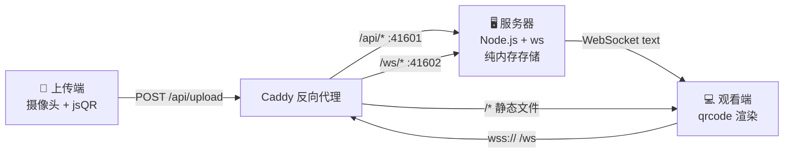
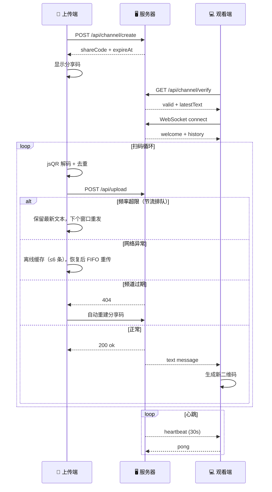

# Live QR

实时二维码扫描与展示系统。上传端通过摄像头扫描二维码并解码为文本，观看端输入 8 位分享码后实时接收文本并重新渲染为二维码。

## 工作原理

### 系统架构



### 数据流时序



## 快速开始

### 本地开发

```bash
# 服务端
cd server
pnpm install
pnpm dev          # → http://localhost:41601

# Web 面板
cd web
pnpm install
pnpm dev          # → http://localhost:41605（已内置 /api 代理）
```

可用命令：

```bash
pnpm build        # 生产构建
pnpm typecheck    # TypeScript 类型检查
pnpm lint         # ESLint 代码检查
pnpm format       # Prettier 代码格式化
pnpm test         # 运行单元测试（单次）
pnpm test:watch   # 运行单元测试（监听模式）
```

### Docker 部署

```bash
cp .env.example .env
docker compose up -d
# 访问 http://localhost:41605
```

## 技术栈

| 层级     | 技术                                               |
| -------- | -------------------------------------------------- |
| 后端     | Node.js 22 + Express 5 + `ws`                      |
| 前端     | Vue 3 + Vite 6 + Tailwind CSS 4（CSS-first）       |
| 配置校验 | Zod + dotenv（启动时校验，非法值立即报错）         |
| 二维码   | jsQR（解码）+ qrcode（生成）                       |
| 代码规范 | ESLint（flat config）+ Prettier                    |
| 测试     | Vitest + supertest（server）/ happy-dom（web）     |
| 反向代理 | Caddy（安全头 + gzip/zstd 压缩）                   |
| 容器化   | Docker 三阶段构建（Node 22 Alpine，Caddy via apk） |
| 数据存储 | 纯内存（`Map<string, ChannelState>`），无数据库    |

## 项目结构

```
Live-QR/
├── .develop/
│   ├── Requirements.md            # 完整需求文档
│   └── Enhancements #1.md         # 技术栈改进记录
├── assets/
│   └── logo.svg                   # 项目 Logo 源文件
├── server/
│   ├── eslint.config.js           # ESLint flat config
│   ├── vitest.config.ts           # Vitest 配置
│   └── src/
│       ├── index.ts               # 入口（优雅关闭）
│       ├── app.ts                 # Express 应用工厂
│       ├── config.ts              # Zod 配置校验 + dotenv
│       ├── types.ts               # 类型定义
│       ├── logger.ts              # 结构化 JSON 日志
│       ├── routes/
│       │   ├── channel.ts         # POST /create · GET /verify
│       │   └── upload.ts          # POST /upload
│       ├── services/
│       │   └── channelStore.ts    # 内存通道管理 + 广播
│       ├── ws/
│       │   └── handler.ts         # WebSocket 服务器
│       └── middleware/
│           ├── rateLimiter.ts     # 滑动窗口限流
│           └── errorHandler.ts    # 全局错误处理
├── web/
│   ├── eslint.config.js           # ESLint flat config (Vue SFC)
│   ├── vitest.config.ts           # Vitest 配置
│   ├── public/
│   │   └── favicon.svg            # Favicon
│   └── src/
│       ├── App.vue                # 根组件（首页/扫描/观看）
│       ├── style.css              # Tailwind CSS v4 入口
│       ├── components/
│       │   ├── ScannerView.vue        # 摄像头扫码界面
│       │   ├── QRDisplay.vue          # 二维码展示卡片
│       │   ├── ShareCodeInput.vue     # 8 位分享码输入
│       │   ├── StatusIndicator.vue    # 6 态连接状态灯
│       │   └── HistoryList.vue        # 历史文本列表（≤200 条）
│       └── composables/
│           ├── useScanner.ts      # 摄像头 + 离线队列 + 节流排队
│           ├── useWebSocket.ts    # WS 连接 + 指数退避重连
│           └── useQRCode.ts       # QR 生成封装（256px/H级/边距4）
├── Caddyfile                      # 反向代理（安全头 + 压缩）
├── Dockerfile                     # 三阶段构建
├── docker-compose.yml             # 单服务编排
├── entrypoint.sh                  # 容器入口
└── .env.example                   # 环境变量模板
```

## API 参考

### 分享码申请

```http
POST /api/channel/create
Content-Type: application/json

{ "expire_seconds": 1800 }    # 可选，默认 1800，范围 [60, 7200]
```

```json
// 201 Created
{
  "code": 201,
  "data": { "shareCode": "12345678", "expireAt": "...", "createdAt": "..." }
}
```

### 文本上传

```http
POST /api/upload
Content-Type: application/json

{ "shareCode": "12345678", "text": "扫描到的文本内容" }
```

```json
// 200 OK
{ "code": 200, "message": "ok" }
```

### 分享码验证

```http
GET /api/channel/verify?shareCode=12345678
```

```json
// 200 OK
{ "code": 200, "valid": true, "latestText": "...", "updatedAt": "..." }
```

### WebSocket 实时通道

```
wss://<host>/ws?shareCode=12345678
```

**服务端 → 客户端：**

| 消息类型          | 说明                    | 附带字段                       |
| ----------------- | ----------------------- | ------------------------------ |
| `welcome`         | 连接成功                | `shareCode`, `viewerCount`     |
| `history`         | 连接前最新文本（≤1 条） | `messages[]`                   |
| `text`            | 新上传的文本            | `data`, `timestamp`（Unix ms） |
| `heartbeat`       | 心跳（每 30 秒）        | `serverTime`                   |
| `channel_expired` | 频道已过期              | `message`                      |

**客户端 → 服务端：**

| 消息类型 | 说明     |
| -------- | -------- |
| `pong`   | 心跳响应 |

**关闭码：**

| 关闭码 | 含义                     |
| ------ | ------------------------ |
| 4001   | 频道不存在或已过期       |
| 4002   | 观看者已满（最多 50 人） |

**心跳策略：**

- 服务端每 30 秒发送 `heartbeat`
- 客户端 60 秒无消息判定断线，触发重连
- 服务端连续 3 次 heartbeat 未收到 pong（90 秒），主动断开

**断线重连：** 指数退避 1s → 2s → 4s → 8s → 16s → 30s（封顶），最多 5 次。期间保留最后一个二维码不变。

## 错误码

| 状态码 | error                    | 说明                          |
| ------ | ------------------------ | ----------------------------- |
| 400    | `INVALID_SHARE_CODE`     | 分享码格式无效（非 8 位数字） |
| 400    | `TEXT_TOO_LONG`          | 文本超过 2000 字符            |
| 400    | `TEXT_EMPTY`             | 文本为空                      |
| 400    | `INVALID_EXPIRE_SECONDS` | 过期时间超出 [60, 7200]       |
| 404    | `CHANNEL_NOT_FOUND`      | 分享码不存在或已过期          |
| 429    | `RATE_LIMITED`           | 上传频率超限（2 次/秒）       |
| 429    | `VERIFY_RATE_LIMITED`    | 验证频率超限（10 次/分钟/IP） |
| 429    | `TOO_MANY_VIEWERS`       | 观看者已满（50 人）           |

## 环境变量

| 变量                       | 默认值 | 说明                      |
| -------------------------- | ------ | ------------------------- |
| `PORT_HTTP`                | 41601  | HTTP API 端口             |
| `PORT_WS`                  | 41602  | WebSocket 端口            |
| `CHANNEL_TTL_SECONDS`      | 1800   | 无上传过期时间（30 分钟） |
| `CLEANUP_INTERVAL_SECONDS` | 60     | 过期清理间隔              |
| `UPLOAD_RATE_LIMIT`        | 2      | 每通道每秒最大上传        |
| `MAX_VIEWERS_PER_CHANNEL`  | 50     | 每通道最大观看者          |
| `VERIFY_RATE_LIMIT`        | 10     | 每 IP 每分钟最大验证      |
| `MAX_TEXT_LENGTH`          | 2000   | 上传文本最大字符数        |
| `CADDY_DOMAIN`             | —      | 域名（用于 HTTPS）        |
| `CADDY_EMAIL`              | —      | Let's Encrypt 通知邮箱    |

> 环境变量经 Zod schema 校验，非法值（如 `PORT_HTTP=abc`）将在启动时立即报错退出。

## 特性

### 上传端

- **去重上传** — 仅文本变化时才上传，避免重复流量
- **节流排队** — 限流时保留最新文本，下个窗口自动发送（合并中间态，保证 ≤2 次/秒）
- **离线缓存** — 网络异常时缓存最多 6 条到内存队列，恢复后 FIFO 重传（带去重）
- **自动重建** — 频道过期后自动申请新分享码并恢复扫描，UI 通知"会话已过期，已自动重建"
- **上传反馈** — 每次上传实时显示成功/失败/限流状态

### 观看端

- **断线重连** — 指数退避（1s → 2s → … → 30s），最多 5 次，期间保留最后一个二维码
- **重连去重** — WebSocket 重连时 `history` 消息自动去重
- **响应式布局** — 适配 PC / 平板 / 手机，二维码最小 200px
- **6 态连接指示** — 未连接 / 验证中 / 等待数据 / 已连接 / 重连中 / 已过期
- **历史记录** — 倒序列表，最多 200 条，含时间戳

### 服务端

- **配置校验** — Zod 运行时校验所有环境变量，非法值立即报错
- **滑动窗口限流** — 上传（每通道 2 次/秒）、验证（每 IP 10 次/分钟）
- **WebSocket 心跳** — 30s 间隔，90s 无响应断连，60s 无消息断连
- **过期清理** — 每 60 秒扫描，30 分钟无上传自动过期
- **优雅关闭** — SIGTERM/SIGINT 时并行关闭 WS + HTTP server
- **结构化日志** — JSON-per-line，区分 info/warn/error
- **安全响应头** — `X-Content-Type-Options`, `X-Frame-Options`, `Strict-Transport-Security`
- **静态压缩** — gzip + zstd

### 部署

- **单容器** — Caddy + Node.js 打包为一个镜像
- **一键启动** — `docker compose up -d`
- **多阶段构建** — web 构建 → server 构建 → 运行时
- **Caddy via apk** — 架构自动适配，版本受控
